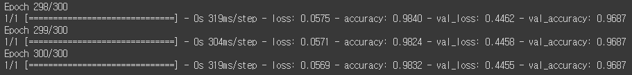
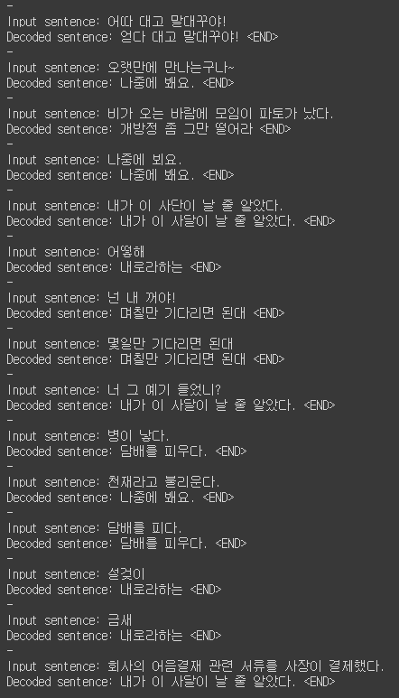

# Spell_Check_LSTM
맞춤법검사 LSTM + seq2seq

번역방식에 착안하여 간단한 문법교정기를 만들어보았다.

# Environment
1. Google Colab
2. Keras
3. LSTM
4. Seq2Seq

# Data
|Worng|Right|
|-----|-----|
|창워느로 출짱 가는 나리 언제니 ?|창원으로 출장 가는 날이 언제니 ?|
|어떻해|어떻게해|

# Result

잘안나온다..

데이터는 임의로 42개를 만들었는데 ..

데이터수의 문제인가 ........ 

# Reference 
- [lstm-seq2seq-machine-translation](https://github.com/adilshagoo87/lstm-seq2seq-machine-translation)
